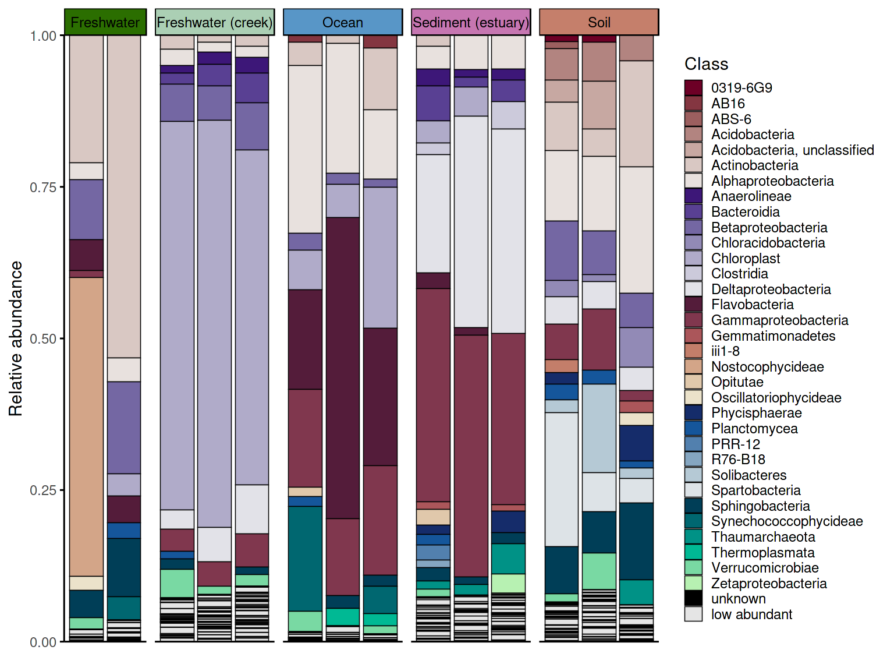
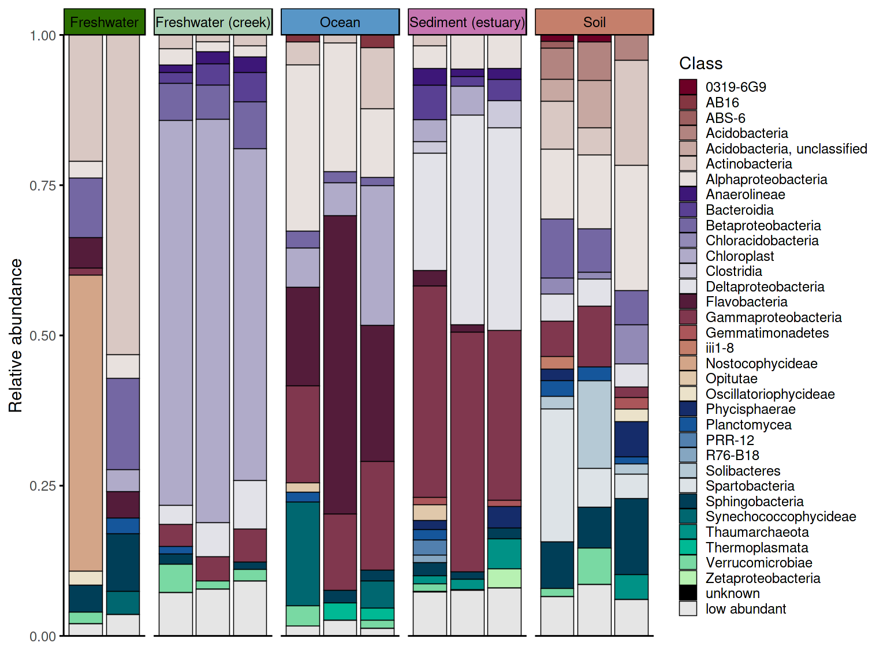
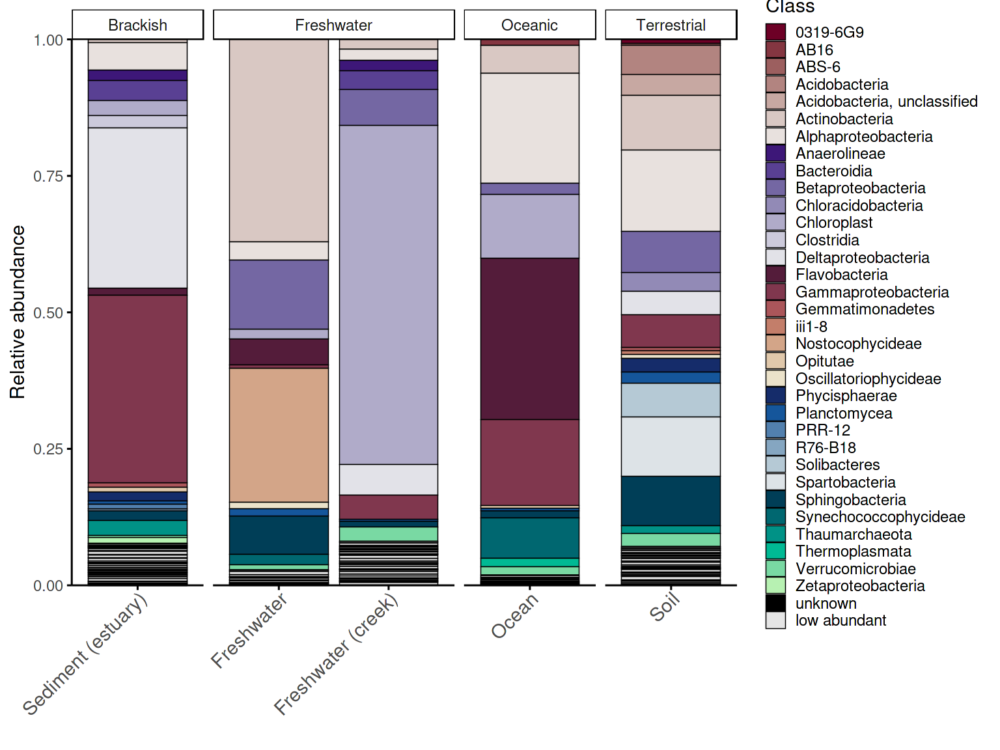
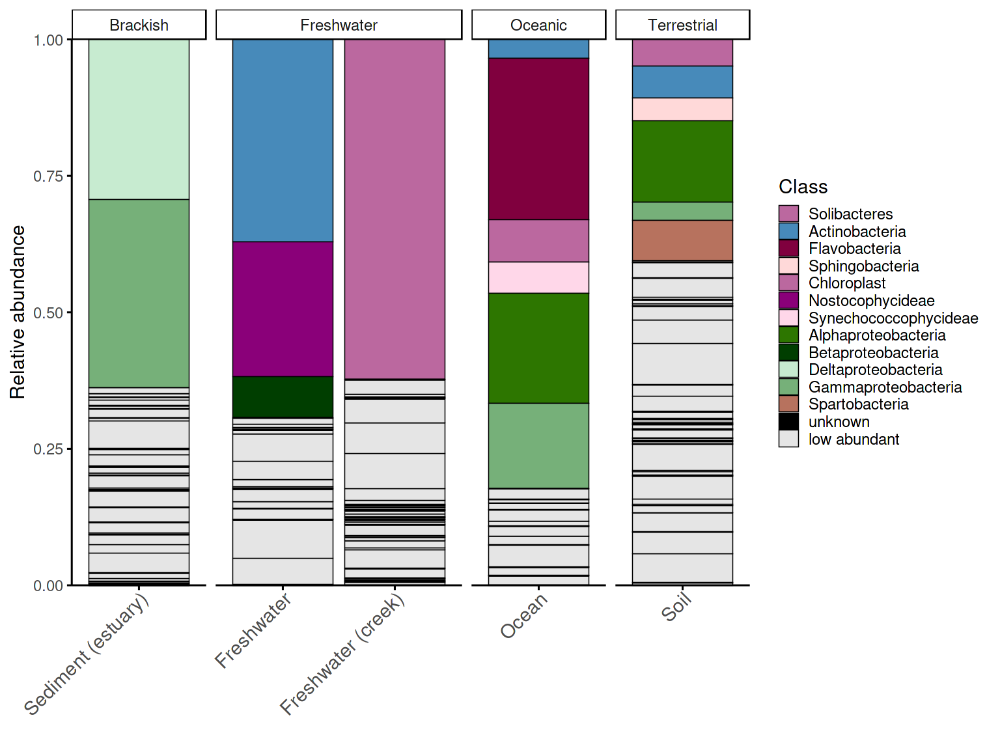
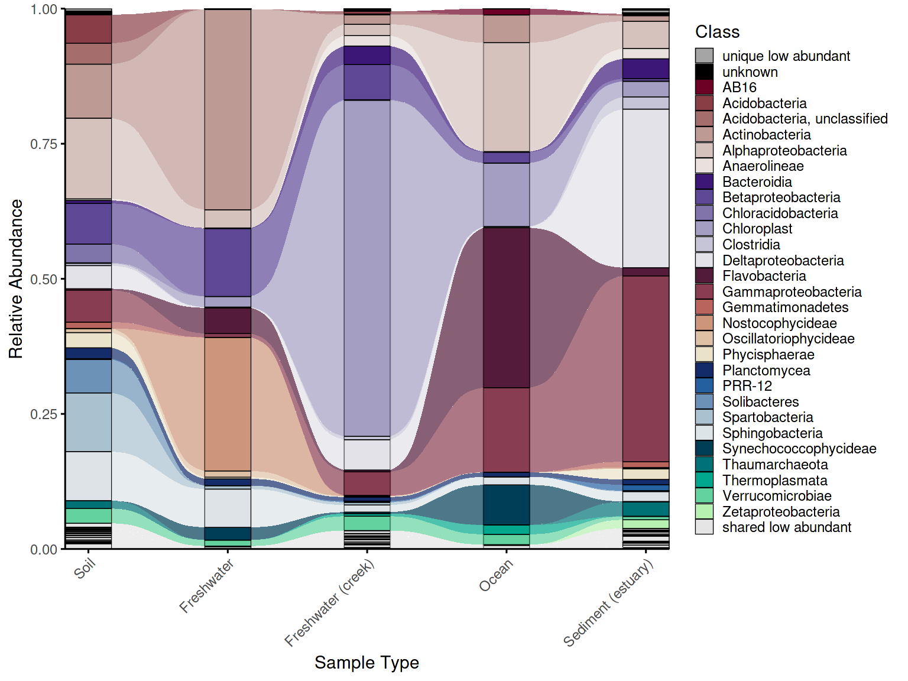
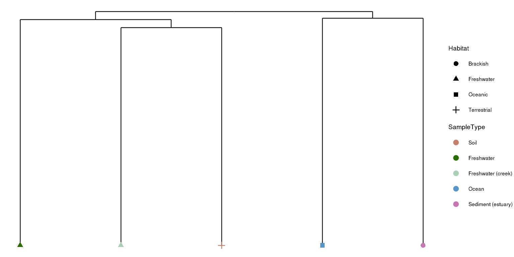
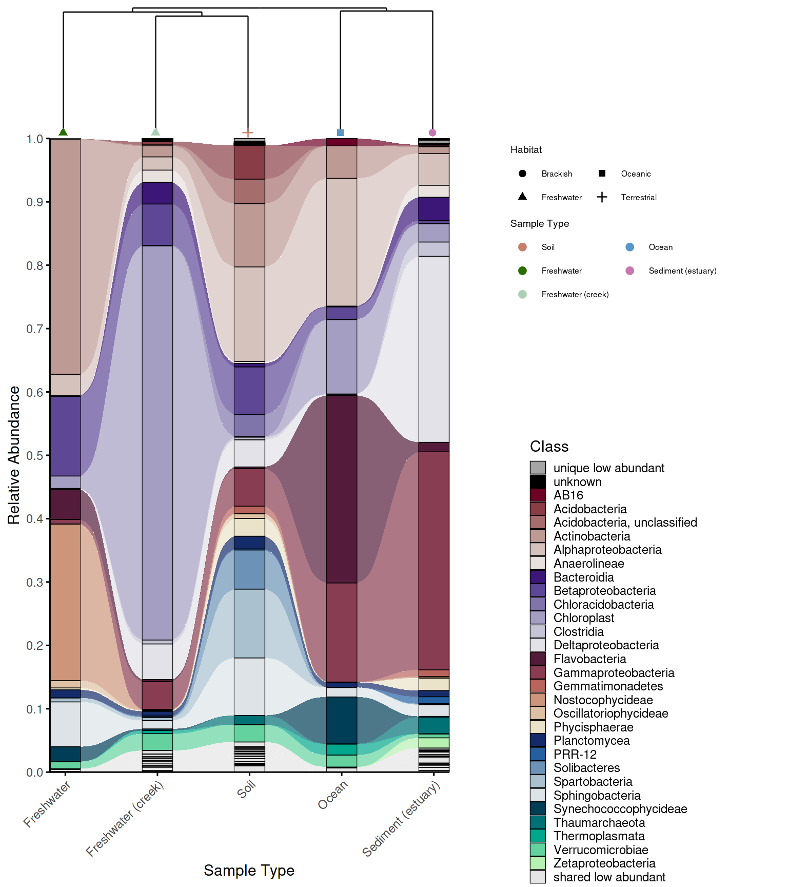
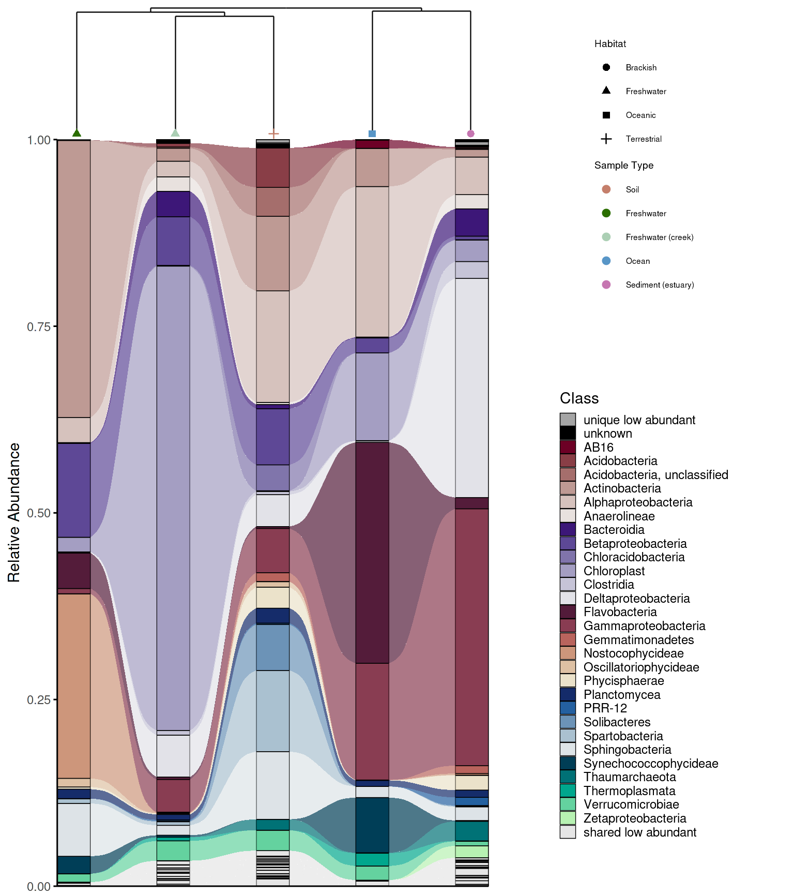
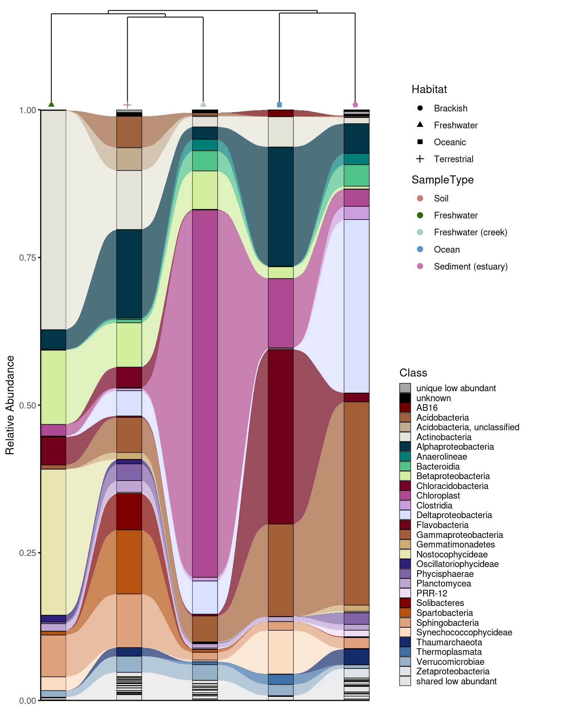

# Getting Started with phyloPal

``` r
library(phyloPal)
library(dplyr)
library(ggplot2) 
library(cowplot) 
library(ggplotify)
```

## Overview

phyloPal is designed around a common bottleneck in microbiome data
visualization: the gap between having processed abundance data and
producing figures that are both publication-ready and honest about
compositional structure. The package provides a connected workflow —
taxonomy cleaning, data aggregation, color palette generation, and
plotting — where each step feeds naturally into the next. Palettes are
aware of taxonomic hierarchy, alluvial plots are aware of which taxa are
shared versus unique across groups, and combined dendrogram-alluvial
figures keep beta diversity and composition aligned in the same panel.

The examples in this vignette use a subset of the `GlobalPatterns`
dataset from the `phyloseq` package, covering five habitat types:
Terrestrial, Oceanic, Freshwater, Brackish, and Freshwater creek.

## Installation

phyloPal is available from GitHub. The `devtools` package is required
for installation:

``` r
# install.packages("devtools")
devtools::install_github("mwslawinska/phyloPal")
```

## Example data

phyloPal ships with a subset of the `GlobalPatterns` dataset from the
`phyloseq` package, filtered to five habitat types.

``` r
data(example_microbiome)
data(em_metadata)
data(em_otu)

# What does it look like?
glimpse(example_microbiome) # long-format ASV table with RA column
#> Rows: 269,024
#> Columns: 14
#> $ SampleID    <chr> "CL3", "CC1", "SV1", "LMEpi24M", "SLEpi20M", "AQC1cm", "AQ…
#> $ OTU         <chr> "549322", "549322", "549322", "549322", "549322", "549322"…
#> $ Counts      <dbl> 0, 0, 0, 0, 1, 27, 100, 130, 1, 0, 0, 0, 0, 0, 0, 0, 0, 0,…
#> $ Depth       <dbl> 864077, 1135457, 697509, 2117592, 1217312, 1167748, 235718…
#> $ RA          <dbl> 0.000000e+00, 0.000000e+00, 0.000000e+00, 0.000000e+00, 8.…
#> $ SampleType  <fct> Soil, Soil, Soil, Freshwater, Freshwater, Freshwater (cree…
#> $ Habitat     <chr> "Terrestrial", "Terrestrial", "Terrestrial", "Freshwater",…
#> $ Description <fct> "Calhoun South Carolina Pine soil, pH 4.9", "Cedar Creek M…
#> $ Kingdom     <chr> "Archaea", "Archaea", "Archaea", "Archaea", "Archaea", "Ar…
#> $ Phylum      <chr> "Crenarchaeota", "Crenarchaeota", "Crenarchaeota", "Crenar…
#> $ Class       <chr> "Thermoprotei", "Thermoprotei", "Thermoprotei", "Thermopro…
#> $ Order       <chr> NA, NA, NA, NA, NA, NA, NA, NA, NA, NA, NA, NA, NA, NA, NA…
#> $ Family      <chr> NA, NA, NA, NA, NA, NA, NA, NA, NA, NA, NA, NA, NA, NA, NA…
#> $ Genus       <chr> NA, NA, NA, NA, NA, NA, NA, NA, NA, NA, NA, NA, NA, NA, NA…
glimpse(em_metadata) # sample metadata
#> Rows: 14
#> Columns: 4
#> $ SampleID    <fct> CL3, CC1, SV1, LMEpi24M, SLEpi20M, AQC1cm, AQC4cm, AQC7cm,…
#> $ SampleType  <fct> Soil, Soil, Soil, Freshwater, Freshwater, Freshwater (cree…
#> $ Habitat     <chr> "Terrestrial", "Terrestrial", "Terrestrial", "Freshwater",…
#> $ Description <fct> "Calhoun South Carolina Pine soil, pH 4.9", "Cedar Creek M…
glimpse(em_otu)
#>  num [1:19216, 1:14] 0 0 0 0 0 0 7 0 153 3 ...
#>  - attr(*, "dimnames")=List of 2
#>   ..$ : chr [1:19216] "549322" "522457" "951" "244423" ...
#>   ..$ : chr [1:14] "CL3" "CC1" "SV1" "LMEpi24M" ...
```

## Workflows

### 1. Data preparation and taxonomy cleaning

phyloPal works with long-format ASV/OTU tables where RA is already
calculated per ASV/OTU.

A built-in taxonomy cleaner
[`replace_incertae_sedis_NAs()`](../reference/replace_incertae_sedis_NAs.md)
standardizes hierarchical taxonomy columns by normalizing common
“Incertae sedis” variants (e.g. “Incertae_Sedis”, “incertae sedis”),
filling missing child ranks from stable parent ranks (e.g. a missing
Family becomes “Rhizobiales, unclassified” if Order is known), and
replacing empty or uninformative entries with `"unknown"`.

All other phyloPal functions call this cleaner internally by default
(`clean_taxonomy = TRUE`), so explicit pre-cleaning is optional but
recommended when you want full control over the taxonomy before
aggregation.

``` r
em_cleaned <- example_microbiome %>%
replace_incertae_sedis_NAs()

glimpse(em_cleaned)
#> Rows: 269,024
#> Columns: 14
#> $ SampleID    <chr> "CL3", "CC1", "SV1", "LMEpi24M", "SLEpi20M", "AQC1cm", "AQ…
#> $ OTU         <chr> "549322", "549322", "549322", "549322", "549322", "549322"…
#> $ Counts      <dbl> 0, 0, 0, 0, 1, 27, 100, 130, 1, 0, 0, 0, 0, 0, 0, 0, 0, 0,…
#> $ Depth       <dbl> 864077, 1135457, 697509, 2117592, 1217312, 1167748, 235718…
#> $ RA          <dbl> 0.000000e+00, 0.000000e+00, 0.000000e+00, 0.000000e+00, 8.…
#> $ SampleType  <fct> Soil, Soil, Soil, Freshwater, Freshwater, Freshwater (cree…
#> $ Habitat     <chr> "Terrestrial", "Terrestrial", "Terrestrial", "Freshwater",…
#> $ Description <fct> "Calhoun South Carolina Pine soil, pH 4.9", "Cedar Creek M…
#> $ Kingdom     <chr> "Archaea", "Archaea", "Archaea", "Archaea", "Archaea", "Ar…
#> $ Phylum      <chr> "Crenarchaeota", "Crenarchaeota", "Crenarchaeota", "Crenar…
#> $ Class       <chr> "Thermoprotei", "Thermoprotei", "Thermoprotei", "Thermopro…
#> $ Order       <chr> "Thermoprotei, unclassified", "Thermoprotei, unclassified"…
#> $ Family      <chr> "unknown", "unknown", "unknown", "unknown", "unknown", "un…
#> $ Genus       <chr> "unknown", "unknown", "unknown", "unknown", "unknown", "un…
```

### 2. Data aggregation and color palettes

Before plotting barplots, raw ASV-level data must be aggregated to the
desired taxonomic level.
[`process_barplot_data()`](../reference/process_barplot_data.md) handles
aggregation, normalization, and low-abundance grouping in one step.

#### Low-abundance handling

A key decision is how to handle low-abundance taxa — those below
`low_abundance_threshold`. The `keep_ratype` argument controls this: -
**`"collapse"`** (simpler): all taxa below the threshold are relabelled
as “low abundant” and merged into a single bin. This keeps the plot
clean and is the right choice when you only care about the dominant
taxa. - **`"separate"`** (more flexible): low-abundance taxa are flagged
but their original identity is preserved in a `<tax_level>_original`
column. The plot-level label becomes `"low abundant"`, but the true
taxon name is retained for downstream use.

The `low_abundance_basis` argument controls **when** the threshold is
applied: - **`"per_sample"`**: taxa are flagged as low abundant within
each individual sample before aggregation. - **`"post_aggregation"`**:
the threshold is applied after averaging across samples or groups.

#### Aggregation function

The `agg_fun` argument controls how relative abundances are combined
when multiple ASVs map to the same taxon within a sample: - **`"sum"`**
adds them together, giving the total relative abundance of that taxon in
the sample. - **`"mean"`** instead averages across ASVs, which is rarely
wanted at the within-sample level but can make sense in specific
workflows. In most cases, use `agg_fun = "sum"`.

### Sample-level aggregation

``` r
em_barplot_processed <- process_barplot_data(
  em_cleaned,
  tax_level = "Class",
  group_vars = c("SampleType", "SampleID", "Habitat"),
  low_abundance_basis = "per_sample",
  low_abundance_threshold = 0.01,
  agg_fun = "sum",
  keep_ratype = "separate",
  clean_taxonomy = FALSE
)


em_barplot_processed2 <- process_barplot_data(
  example_microbiome,
tax_level = "Class",
group_vars = c("SampleType", "SampleID", "Habitat"),
low_abundance_threshold = 0.01,
keep_ratype = "collapse",
clean_taxonomy = TRUE,
preserve_higher_taxonomy = T
)

glimpse(em_barplot_processed)
#> Rows: 1,467
#> Columns: 6
#> $ SampleType     <fct> Freshwater, Freshwater, Freshwater, Freshwater, Freshwa…
#> $ SampleID       <chr> "LMEpi24M", "LMEpi24M", "LMEpi24M", "LMEpi24M", "LMEpi2…
#> $ Habitat        <chr> "Freshwater", "Freshwater", "Freshwater", "Freshwater",…
#> $ Class          <chr> "Actinobacteria", "Alphaproteobacteria", "Betaproteobac…
#> $ Class_original <chr> "Actinobacteria", "Alphaproteobacteria", "Betaproteobac…
#> $ RA             <dbl> 2.099578e-01, 2.797942e-02, 9.945164e-02, 5.051917e-02,…
glimpse(em_barplot_processed2)
#> Rows: 188
#> Columns: 6
#> $ SampleType <fct> Freshwater, Freshwater, Freshwater, Freshwater, Freshwater,…
#> $ SampleID   <chr> "LMEpi24M", "LMEpi24M", "LMEpi24M", "LMEpi24M", "LMEpi24M",…
#> $ Habitat    <chr> "Freshwater", "Freshwater", "Freshwater", "Freshwater", "Fr…
#> $ Phylum     <chr> "Actinobacteria", "Bacteroidetes", "Bacteroidetes", "Cyanob…
#> $ Class      <chr> "Actinobacteria", "Flavobacteria", "Sphingobacteria", "Nost…
#> $ RA         <dbl> 2.099578e-01, 5.051917e-02, 4.535482e-02, 4.927715e-01, 2.3…
```

#### Group-level aggregation and barplot

Rather than keeping individual samples, data can be aggregated to the
group level — for example, averaging relative abundances across all
samples of the same `SampleType`. This is useful when you have many
samples per group and want a single representative bar per group, or
when you want to compare broad habitat-level patterns rather than
sample-level variation. To do this, pass the grouping variables to
`group_vars` and set `normalize_by` to the same variables — this tells
[`process_barplot_data()`](../reference/process_barplot_data.md) to
normalize within groups rather than within individual samples. The
resulting data frame has one row per taxon per group, ready for plotting
with
[`plot_taxonomic_barplot()`](../reference/plot_taxonomic_barplot.md).

``` r
em_processed_grouped2 <- process_barplot_data(
  example_microbiome,
  tax_level = "Class",
  group_vars = c("SampleType", "Habitat"),
  normalize_by = c("SampleType", "Habitat"),
  low_abundance_threshold = 0.01,
  preserve_higher_taxonomy = TRUE,
  low_abundance_basis = "per_sample",
  agg_fun = "sum",
  keep_ratype = "separate"
)
```

#### Color palettes

[`generate_palette_hcl()`](../reference/generate_palette_hcl.md)
generates perceptually uniform HCL palettes for any number of taxa. HCL
(Hue-Chroma-Luminance) colors are preferred for scientific visualization
because equal steps in HCL space correspond to equal perceived
differences in color — unlike RGB-based palettes where some colors
appear much brighter or more saturated than others.

``` r
barplot_pal <- generate_palette_hcl(
  data = em_barplot_processed,
  tax_level = "Class",
  fixed_colors_enabled = TRUE,
  fixed_colors_position = "end",
  palette_list = c("Reds", "Purples", "BrwnYl", "Blues", "TealGrn"),
  cmax = 65,
  luminance = c(20,90),
    power = 1.2,
    shuffle = FALSE)
```

#### Grouped palette for sample metadata

[`generate_grouped_palette()`](../reference/generate_grouped_palette.md)
assigns colors from the same color family to items sharing a
higher-level group — for example, all freshwater sample types in green
tones, all oceanic sample types in blue tones. Beyond facet strip
coloring, this palette is useful whenever consistent color coding across
multiple figure types is needed: if barplot facet strips, dendrogram
labels, and beta-diversity ordination plots are colored by the same
habitat palette, all figures in a panel share a common visual language
and the reader only needs to learn the color scheme once. This is
particularly valuable when plotting multiple samples per group — for
example, PCoA or NMDS plots where individual samples are colored by
their higher-level group membership.

``` r

habitat_palette <- generate_grouped_palette(
  data = em_cleaned,
  group_col = "Habitat",
  item_col = "SampleType",
  palette_map = list(
    "Terrestrial" = "BrwnYl",
    "Oceanic" = "Blues",
    "Freshwater" = "Greens",
    "Brackish" = "PuRd"
  ),
  luminance = 65,
  power = 1.2
)
```

#### Grouped palette for taxa

The principle used in
[`generate_grouped_palette()`](../reference/generate_grouped_palette.md)
can be applied to taxonomic palettes, too. When datasets contain many
taxa, a flat palette where colors are assigned arbitrarily can make it
hard to orient visually.
[`generate_palette_hcl()`](../reference/generate_palette_hcl.md)
supports optional hierarchical grouping via `group_by_higher_tax` and
`group_palette_map` — all families belonging to Proteobacteria get blue
tones, all Actinobacteria get red tones, and so on. This makes the
biological structure of the community visible at a glance rather than
requiring careful legend inspection. However, hierarchical grouping is
recommended only for smaller datasets with fewer than ~10 higher-level
taxa — synthetic communities are a typical use case. For complex natural
communities with many phyla or classes, the ungrouped palette is
typically more interpretable, as too many color families become
difficult to distinguish.

``` r
em_processed_grouped <- process_barplot_data(
  example_microbiome,
  tax_level = "Class",
  group_vars = c("SampleType", "Habitat"),
  normalize_by = c("SampleType", "Habitat"),
  low_abundance_threshold = 0.1,
  preserve_higher_taxonomy = TRUE,
  low_abundance_basis = "per_sample",
  agg_fun = "sum",
  keep_ratype = "separate"
)

barplot_pal_grouped <- generate_palette_hcl(
  data = em_processed_grouped,
  tax_level = "Class",
   group_by_higher_tax = "Phylum",
   order_by_higher_tax = TRUE,
   group_palette_map = list(
     "Actinobacteria" = "Blues",
     "Proteobacteria" = "Greens",
     "Cyanobacteria" = list(palette = "Purple-Orange", side = "right"),
     "Acidobacteria" = list(palette = "Purple-Orange", side = "right"),
     "Bacteroidetes" = "Burg",
     "Verrucomicrobia" = "BrwnYl"),
  fixed_colors_enabled = TRUE,
  fixed_colors_position = "end",
  order_groups = "alphabetical",
  order_within_groups = "alphabetical",
  cmax = 65,
  luminance = c(20,90),
    power = 1.2,
    shuffle = FALSE)
```

### 3. Taxonomic barplots

#### Colored facet strips

Facet strips — the label bars above or beside each panel in a faceted
plot — are a missed opportunity in most microbiome figures. By default
they carry only a text label, but coloring them to match a higher-level
grouping variable adds a second layer of information without cluttering
the plot. For example, if samples are faceted by `SampleType` but the
`Habitat` each sample type belongs to should also be visible, coloring
the strips by habitat lets the reader group panels visually — all
freshwater panels share one color, all oceanic panels another — without
adding an extra legend or annotation layer.

In base `ggplot2` and even with `ggh4x`, achieving this requires verbose
boilerplate code that is easy to get wrong and hard to keep consistent
across figures. In phyloPal, you pass a named color vector directly to
`facet_strip_colors` in
[`plot_taxonomic_barplot()`](../reference/plot_taxonomic_barplot.md) —
the same vector produced by
[`generate_grouped_palette()`](../reference/generate_grouped_palette.md)
— and the coloring is handled automatically. This makes it
straightforward to keep strip colors consistent with other plot elements
such as dendrogram labels, ordination point colors, or sample metadata
annotations across all figures in a panel.

``` r
p_barplot <- plot_taxonomic_barplot(
  data = em_barplot_processed,
  tax_level = "Class",
  palette = barplot_pal,
  x_axis_var = "SampleID",
  facet_by = "SampleType",
  facet_strip_colors = habitat_palette,
  theme_obj = theme_phylopal()
) + 
  ggplot2::guides(
    fill = guide_legend(
      ncol = 1
    )
  ) 

p_barplot
```



The two data processing approaches produce visually different results.
With `keep_ratype = "separate"`, each low-abundance taxon retains its
own identity in the `<tax_level>_original` column and is shown
individually in the plot. With `keep_ratype = "collapse"`, all
low-abundance taxa are merged into a single `"low abundant"` bin,
producing a cleaner barplot. The choice depends on whether the identity
of rare taxa matters for interpretation.

``` r
p_barplot2 <- plot_taxonomic_barplot(
  data = em_barplot_processed2,
  tax_level = "Class",
  palette = barplot_pal,
  x_axis_var = "SampleID",
  facet_by = "SampleType",
  facet_strip_colors = habitat_palette,
  theme_obj = theme_phylopal()
) + 
  ggplot2::guides(
    fill = guide_legend(
      ncol = 1
    )
  ) 

p_barplot2
```



#### Group-level barplot

Using the group-level aggregated data prepared in the previous section,
[`plot_taxonomic_barplot()`](../reference/plot_taxonomic_barplot.md)
produces one bar per group rather than one bar per sample — useful for
comparing broad habitat-level patterns across conditions.

``` r
p_barplot_grouped2 <- plot_taxonomic_barplot(
  data = em_processed_grouped2,
  tax_level = "Class",
  palette = barplot_pal,
  x_axis_var = "SampleType",
  facet_by = "Habitat",
  theme_obj = theme_phylopal() 
) + 
  ggplot2::guides(
    fill = guide_legend(
      ncol = 1
    )
  )  + theme(axis.text.x = element_text(size =11, angle = 45, hjust = 1, vjust = 1),
    axis.ticks.x = ggplot2::element_line(color = "black", linewidth = 0.4))

p_barplot_grouped2
```



#### Barplot with hierarchical taxonomic palette

The same group-level data can be plotted with a hierarchically grouped
palette, where taxa belonging to the same phylum share a color family.
This makes it easier to identify the dominant phylum in each habitat at
a glance, without tracing every taxon back to the legend.

``` r
p_barplot_grouped <- plot_taxonomic_barplot(
  data = em_processed_grouped,
  tax_level = "Class",
  palette = barplot_pal_grouped,
  x_axis_var = "SampleType",
  facet_by = "Habitat",
  theme_obj = theme_phylopal() 
) + 
  ggplot2::guides(
    fill = guide_legend(
      ncol = 1
    )
  )  + theme(axis.text.x = element_text(size =11, angle = 45, hjust = 1, vjust = 1),
    axis.ticks.x = ggplot2::element_line(color = "black", linewidth = 0.4))

p_barplot_grouped
```



### 4. Alluvial plots

Alluvial plots (also called Sankey diagrams) show how compositional
structure changes across groups — which taxa are present in all groups,
which are unique to one, and which shift in abundance between
conditions.

#### Taxa classification

Before plotting, taxa must be classified by their abundance pattern
across groups using
[`classify_taxa_patterns()`](../reference/classify_taxa_patterns.md),
which assigns each taxon to one of four categories: - **shared
abundant**: present and abundant in all groups - **shared low
abundant**: present in all groups but always below the threshold -
**unique abundant**: abundant in some groups but absent in others -
**unique low abundant**: present in only some groups and always rare

Taxa that are abundant in some groups but low in others are optionally
detected as **shared mixed abundance** (enabled by default). These
categories determine both the palette key assigned to each taxon and its
stacking position in the plot — shared taxa appear at the bottom, unique
taxa toward the top, and fixed categories like `"unknown"` and
`"low abundant"` always occupy consistent positions.

#### Step-by-step workflow

The full workflow requires four steps:
[`prepare_alluvial_data()`](../reference/prepare_alluvial_data.md) →
[`classify_taxa_patterns()`](../reference/classify_taxa_patterns.md) →
[`generate_alluvial_palette()`](../reference/generate_alluvial_palette.md)
→ [`plot_alluvial()`](../reference/plot_alluvial.md). Each step can be
customised independently — for example, using a hierarchical grouped
palette, passing special taxa that should never be collapsed into the
low-abundance bin, or adjusting classification thresholds independently
of the palette.

``` r
# arrange the SampleType like you want
example_microbiome$SampleType <- factor(example_microbiome$SampleType, 
levels = unique(example_microbiome$SampleType))

# prepare alluvial data
em_allu <- prepare_alluvial_data(example_microbiome,
tax_level = "Class",
group_col = c("SampleType"),
clean_taxonomy = TRUE
)

# classify taxa patterns according to their abundance
em_allu_classified <- classify_taxa_patterns(
  data = em_allu,
  tax_level = "Class",
  group_col = c("SampleType")
)

glimpse(em_allu_classified)
#> Rows: 885
#> Columns: 7
#> $ SampleType <fct> Soil, Soil, Soil, Soil, Soil, Soil, Soil, Soil, Soil, Soil,…
#> $ Class      <chr> "0319-6G9", "09D2Y74", "12-24", "4C0d-2", "5B-18", "A712011…
#> $ RA         <dbl> 7.304586e-03, 0.000000e+00, 0.000000e+00, 1.013804e-03, 6.0…
#> $ tax_val    <chr> "0319-6G9", "09D2Y74", "12-24", "4C0d-2", "5B-18", "A712011…
#> $ tax_type   <chr> "shared low abundant", "unique low abundant", "unique low a…
#> $ category   <chr> "shared low abundant", "unique low abundant", "unique low a…
#> $ tax_color  <chr> "shared low abundant", "unique low abundant", "unique low a…

# generate palette for the alluvial plot
allu_pal <- generate_alluvial_palette(
    data = em_allu_classified,
  palette_list = c("Reds", "Purples", "BrwnYl", "Blues", "TealGrn"),
  cmax = 65,
  luminance = c(20,90),
    power = 1.2,
    )

# plot the alluvial plot
p_allu <- plot_alluvial(em_allu_classified, 
custom_palette = allu_pal,
tax_level = "Class", 
group_col = "SampleType",
theme_obj = theme_phylopal(),
line_width = 0.2,
x_axis_label = "Sample Type"
) +
ggplot2::theme(axis.text.x = element_text(angle = 45, hjust = 1)) +
  ggplot2::guides(
    fill = guide_legend(
      ncol = 1
    )
  )

p_allu
```



#### Convenience wrapper

For standard use cases,
[`create_alluvial_plot()`](../reference/create_alluvial_plot.md) wraps
the entire workflow into a single call, accepting nested argument lists
(`prepare_args`, `classify_args`, `palette_args`, `plot_args`) passed
through to each step. This makes it straightforward to go from raw data
to a finished plot in a few lines, while retaining the option to drop
into the step-by-step workflow whenever more control is needed.

``` r
em_allu_wrapper <- create_alluvial_plot(
  data = example_microbiome,
  tax_level = "Class",
  group_col = "SampleType",
  prepare_args = list(clean_taxonomy = TRUE),
  palette_list = c("Reds", "Purples", "BrwnYl", "Blues", "TealGrn"),
  palette_args = list(
    cmax = 65,
    luminance = c(20, 90),
    power = 1.2
  ),
  plot_args = list(
    theme_obj = theme_phylopal(),
    line_width = 0.2,
    x_axis_label = "Sample Type"
  )
) +
  ggplot2::theme(axis.text.x = ggplot2::element_text(angle = 45, hjust = 1, vjust = 1)) +
  ggplot2::guides(fill = ggplot2::guide_legend(ncol = 1))

em_allu_wrapper
```

 \### 5.
Alluvial plot combined with dendrogram

While an alluvial plot shows taxonomic composition across groups, it
carries no information about how similar those groups are to each other
overall. A sample dendrogram addresses this — it clusters groups by beta
diversity (here Bray-Curtis dissimilarity) and reveals which communities
are most similar in overall structure. Combining both plots in a single
figure lets the reader interpret compositional patterns in the context
of community-level relationships: groups that cluster closely in the
dendrogram are expected to share more taxa in the alluvial plot, and
deviations from this expectation become immediately visible.

#### Building the dendrogram

To create a dendrogram from grouped data (one column per `SampleType`
rather than per sample), first average the ASV/OTU matrix within groups
using
[`create_grouped_matrix()`](../reference/create_grouped_matrix.md), then
build the dendrogram with
[`build_dendrogram()`](../reference/build_dendrogram.md) and plot it
with [`plot_dendrogram()`](../reference/plot_dendrogram.md). The
`color_by` and `shape_by` arguments in
[`plot_dendrogram()`](../reference/plot_dendrogram.md) allow metadata
variables to be encoded directly on the dendrogram labels, keeping it
visually consistent with the alluvial plot and other figures in the
panel.

Beta-diversity distances are computed using the `vegan` package (Oksanen
et al., 2022).

``` r
em_otu_grouped <- create_grouped_matrix(
asv_matrix = em_otu,
metadata = em_metadata,
sample_col = "SampleID",
group_col= "SampleType",
group_order = "metadata"
)

em_dendrogram <- build_dendrogram(
  mat = em_otu_grouped,
  distance_method = "bray",
  cluster_method = "ward.D2"
)
#> Registered S3 method overwritten by 'dendextend':
#>   method     from 
#>   rev.hclust vegan

em_dendrogram_plot <- plot_dendrogram(
  dend = em_dendrogram,
  metadata = em_metadata,
  label_from = "SampleType",      
  color_by = "SampleType",
  color_palette = habitat_palette,
  point_size = 2,
  orientation = "top",
  shape_by = "Habitat",
  theme_obj = theme_void() + theme(text = element_text(size = 7, color = "black"),
  legend.title = element_text(size = 7, color = "black"),)
)

em_dendrogram_plot
```



#### Combining the plots

[`combine_dendrogram_alluvial()`](../reference/combine_dendrogram_alluvial.md)
stacks the two plots vertically and aligns their x-axes to the
dendrogram leaf order, so the columns of the alluvial plot follow the
same left-to-right arrangement as the dendrogram tips. This alignment is
handled automatically via `leaf_order` — without it, the two plots would
use independent orderings and the visual connection between them would
be lost.

#### Fine-tuning alignment

A practical challenge when combining dendrograms with alluvial plots is
that dendrogram tips rarely fall exactly at integer x positions —
branches have varying widths and the outermost tips tend to drift,
creating a misalignment between the dendrogram leaves and the alluvial
columns beneath them. `dend_limits_left` and `dend_limits_right` control
the x-axis limits of the dendrogram panel via
[`coord_cartesian()`](https://ggplot2.tidyverse.org/reference/coord_cartesian.html),
allowing precise alignment without dropping any data. Increasing
`dend_limits_left` adds space on the left side of the dendrogram panel,
pushing the leftmost tip further left — away from the first alluvial
column. Increasing `dend_limits_right` reduces space on the right side,
pushing the rightmost tip leftward — toward the center and away from the
last alluvial column. The two parameters therefore behave
asymmetrically: `dend_limits_left` pulls the left tip outward, while
`dend_limits_right` pulls the right tip inward. The correct values
depend on the number of groups and the specific clustering, so some
manual adjustment is expected and normal. For vertical dendrograms, use
`dend_limits_top` and `dend_limits_bottom` instead.

#### Legend control

The `legend` argument controls whether legends are included in the
combined figure: `"separate"` places legends outside the plot area,
`"omit"` removes them entirely, and `"together"` merges them into one.
Omitting legends is useful when full manual control over placement is
needed — for example, when using `cowplot` or `ggpubr` to arrange
legends alongside other figure panels.

``` r

p_allu4dend <- create_alluvial_plot(
  data = example_microbiome,
  tax_level = "Class",
  group_col = "SampleType",
  prepare_args = list(clean_taxonomy = TRUE),
  palette_list = c("Reds", "Purples", "BrwnYl", "Blues", "TealGrn"),
  palette_args = list(
    cmax = 65,
    luminance = c(20, 90),
    power = 1.2
  ),
  plot_args = list(
    theme_obj = theme_phylopal(),
    line_width = 0.2,
    x_axis_label = "Sample Type"
  )
) +
  ggplot2::theme(axis.text.x = ggplot2::element_text(angle = 45, hjust = 1)) +
  ggplot2::guides(fill = ggplot2::guide_legend(ncol = 1))


# dendrogram and alluvial with legends
dendrogram_alluplot <- combine_dendrogram_alluvial(
  alluvial_plot   = p_allu4dend +
  scale_y_continuous(expand = c(0,0), breaks = seq(0,1,0.1), limits = c(0,1))+
  ggplot2::guides(fill = guide_legend(ncol =1, title = "Class")),
  dendrogram_plot = em_dendrogram_plot +
  ggplot2::guides(color = guide_legend(ncol = 2, title = "Sample Type"), shape = guide_legend(ncol = 2)),
  dend_position   = "top",
  dend_height     = 0.15,
  strip_alluvial_x = FALSE,
  legend          = "separate",
  legend_source   = "both",       
  legend_position = "right",
  legend_rel_width = 0.75,            
  alluvial_margins    = ggplot2::margin(0, 0, 0, 0, unit = "cm"),
  dendrogram_margins    = ggplot2::margin(0, 0, 0.15, 0, unit = "cm"),
  outer_margins    = ggplot2::margin(0.2, 0.2, 0.2, 0.2, unit = "cm"),
  align = "panel",
  x_expand_zero = TRUE,
  align_x_centers = TRUE,
  leaf_order = em_dendrogram$order,
  overwrite_x_scales = TRUE,
  dend_limits_left = 0.4,  
  dend_limits_right = 0.18
) 
#> Scale for y is already present.
#> Adding another scale for y, which will replace the existing scale.
#> Scale for x is already present.
#> Adding another scale for x, which will replace the existing scale.
#> Scale for x is already present.
#> Adding another scale for x, which will replace the existing scale.
#> Coordinate system already present.
#> ℹ Adding new coordinate system, which will replace the existing one.
grid::grid.draw(dendrogram_alluplot)
```



``` r
dendrogram_alluplot_control <- combine_dendrogram_alluvial(
  alluvial_plot   = p_allu4dend,
  dendrogram_plot = em_dendrogram_plot,
  dend_position   = "top",
  dend_height     = 0.15,
  strip_alluvial_x = TRUE,
  legend          = "omit",
  legend_source   = "both",       
  legend_position = "right",
  legend_rel_width = 0.75,            
  alluvial_margins    = ggplot2::margin(0, 0, 0, 0, unit = "cm"),
  dendrogram_margins    = ggplot2::margin(0, 0, 0.15, 0, unit = "cm"),
  outer_margins    = ggplot2::margin(0.2, 0.2, 0.2, 0.2, unit = "cm"),
  align = "panel",
  x_expand_zero = TRUE,
  align_x_centers = TRUE,
  leaf_order = em_dendrogram$order,
  overwrite_x_scales = TRUE,
  dend_limits_left = 0.3,  
  dend_limits_right = 0.18
) 
#> Scale for x is already present.
#> Adding another scale for x, which will replace the existing scale.
#> Scale for x is already present.
#> Adding another scale for x, which will replace the existing scale.
#> Coordinate system already present.
#> ℹ Adding new coordinate system, which will replace the existing one.


legend_alluplot <- ggpubr::get_legend(p_allu4dend + 
                                            guides(
                                              fill = guide_legend(ncol =1, title = "Class")))


legend_dendrogram <- ggpubr::get_legend(
  em_dendrogram_plot + 
  ggplot2::guides(color = guide_legend(ncol = 1, title = "Sample Type"), shape = guide_legend(ncol = 1))+
    ggplot2::theme(legend.position = "right", 
          legend.box = "vertical",
          legend.title.position = "top",
          plot.margin = margin(0,0,0,0))
)

p_allu_full <- cowplot::plot_grid(
  cowplot::plot_grid(
    ggplotify::as.ggplot(dendrogram_alluplot_control),
    cowplot::plot_grid(
      legend_dendrogram,
      legend_alluplot,
      rel_heights = c(0.6, 1),
      rel_widths = c(1, 1),
      ncol = 1,
      align = "hv", axis = "tblr"
    ),
    rel_widths = c(1,0.6),
    ncol = 2,
    align = "hv", axis = "tblr"
  )
)

grid::grid.draw(p_allu_full)
```



#### Convenience wrapper

The whole process can be simplified using the
[`create_alluvial_dendrogram_plot()`](../reference/create_alluvial_dendrogram_plot.md)
wrapper, which runs the full pipeline — grouping the ASV/OTU matrix,
building the dendrogram, preparing and classifying alluvial data,
generating the palette, and combining the plots — in a single call.

It takes as input the raw ASV/OTU matrix (`asv_matrix`, samples as
columns and ASVs/OTUs as rows), a metadata data frame, and the
long-format ASV/OTU table with pre-calculated RA (`alluvial_data`).

Arguments for each internal step are passed as named lists:
`build_dendrogram_args` and `plot_dendrogram_args` control the
dendrogram, while `alluvial_args` accepts nested `prepare_args`,
`classify_args`, `palette_args`, and `plot_args` forwarded to the
respective alluvial functions. Layout parameters like
`dend_limits_left`, `dend_limits_right`, and `legend_rel_width` are
direct arguments rather than nested, since they are commonly adjusted.

The function returns a named list containing all intermediate objects —
`grouped_matrix`, `dendrogram`, `dendrogram_plot`, `alluvial`, and
`combined_plot` — so any component can be accessed for further
customization or export without rerunning the pipeline.

Use the wrapper for standard workflows and drop into the step-by-step
approach when you need to modify an intermediate result.

``` r
res <- create_alluvial_dendrogram_plot(
  asv_matrix = em_otu,
  metadata = em_metadata,
  sample_col = "SampleID",
  group_col  = "SampleType",
  alluvial_data = example_microbiome,
  tax_level = "Class",
  dend_color_palette = habitat_palette,
  dend_shape_by = "Habitat",
  theme_alluvial = theme_phylopal(),
  theme_dendrogram = ggplot2::theme_void(),
  alluvial_args = list(
    return_all = TRUE,
    prepare_args = list(clean_taxonomy = TRUE),
    classify_args = list(low_abundance_threshold = 0.01),
    palette_args = list(
      palette_list = c("Reds", "Purples", "BrwnYl", "Blues", "TealGrn"),
      cmax = 65,
      luminance = c(20, 90),
      power = 1.2
    ),
    plot_args = list(
      line_width = 0.2,
      x_axis_label = "Sample Type"
    )
  ),
  post_plot_guides   = list(      # guides applied to alluvial
    fill = ggplot2::guide_legend(ncol = 1, title = "Class")
  ),    
  dend_limits_left = 0.4,  
  dend_limits_right = 0.18, 
  combine_args = list(
    legend_rel_width = 0.5,
    strip_alluvial_x = TRUE,  
    alluvial_margins = ggplot2::margin(0, 0, 0, 0, unit = "cm"),
    outer_margins    = ggplot2::margin(0.2, 0.5, 0.2, 0.2, unit = "cm") 
  )
)
#> Scale for x is already present.
#> Adding another scale for x, which will replace the existing scale.
#> Coordinate system already present.
#> ℹ Adding new coordinate system, which will replace the existing one.

p_em_alluvial_dend_wrapper <- res$combined_plot

grid::grid.draw(p_em_alluvial_dend_wrapper)
```



## Function reference

| Function | What it does |
|----|----|
| [`replace_incertae_sedis_NAs()`](../reference/replace_incertae_sedis_NAs.md) | Clean taxonomy: normalize Incertae Sedis, propagate parent taxa |
| [`process_barplot_data()`](../reference/process_barplot_data.md) | Aggregate ASV-level RA to taxonomic level, mark low-abundance taxa |
| [`prepare_alluvial_data()`](../reference/prepare_alluvial_data.md) | Aggregate and complete zeros for alluvial input |
| [`classify_taxa_patterns()`](../reference/classify_taxa_patterns.md) | Classify taxa as shared/unique/mixed-abundance across groups |
| [`generate_palette_hcl()`](../reference/generate_palette_hcl.md) | HCL palette with optional hierarchical grouping by higher taxonomy |
| [`generate_grouped_palette()`](../reference/generate_grouped_palette.md) | Assign color families to groups (e.g. for facet strip colors) |
| [`generate_alluvial_palette()`](../reference/generate_alluvial_palette.md) | Alluvial-aware palette respecting shared/unique structure |
| [`add_alpha()`](../reference/add_alpha.md) | Add transparency to hex colors |
| [`plot_taxonomic_barplot()`](../reference/plot_taxonomic_barplot.md) | Stacked barplot with optional colored facet strips |
| [`plot_alluvial()`](../reference/plot_alluvial.md) | Alluvial/Sankey plot |
| [`build_dendrogram()`](../reference/build_dendrogram.md) | Compute Bray-Curtis dendrogram from ASV/OTU matrix |
| [`plot_dendrogram()`](../reference/plot_dendrogram.md) | Plot dendrogram with metadata-colored labels |
| [`combine_dendrogram_alluvial()`](../reference/combine_dendrogram_alluvial.md) | Combine alluvial + dendrogram with aligned axes |
| [`create_alluvial_plot()`](../reference/create_alluvial_plot.md) | Full alluvial workflow wrapper |
| [`create_alluvial_dendrogram_plot()`](../reference/create_alluvial_dendrogram_plot.md) | Full alluvial + dendrogram wrapper |
| [`theme_phylopal()`](../reference/theme_phylopal.md) | Clean built-in ggplot2 theme |

------------------------------------------------------------------------

## References

Caporaso, J.G., et al. (2011). Global patterns of 16S rRNA diversity at
a depth of millions of sequences per sample. *PNAS*, 108, 4516–4522.

Oksanen, J., et al. (2022). vegan: Community Ecology Package. R package
version 2.6-4. <https://CRAN.R-project.org/package=vegan>

Brunson, J.C. (2020). ggalluvial: Layered Grammar for Alluvial Plots.
*Journal of Open Source Software*, 5(49), 2017.

## Citation

If you use phyloPal in your research, please cite: Slawinska MW (2025).
phyloPal: Taxonomic Color Palettes and Alluvial-Dendrogram Visualization
for Microbiome Data. R package version 0.1.0.
<https://github.com/mwslawinska/phyloPal>

------------------------------------------------------------------------

## License

MIT © Magdalena W. Slawinska
