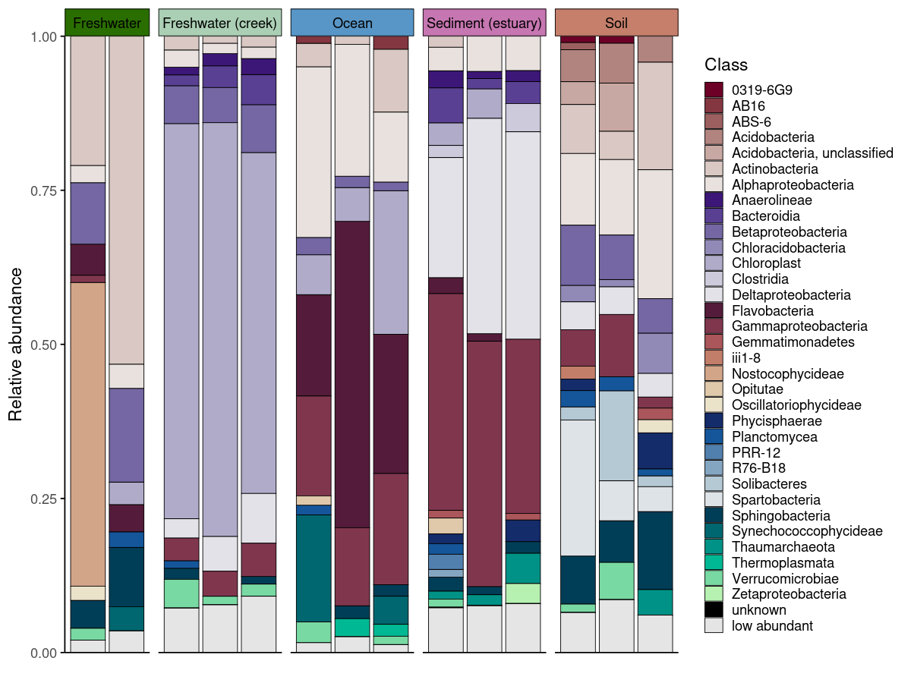
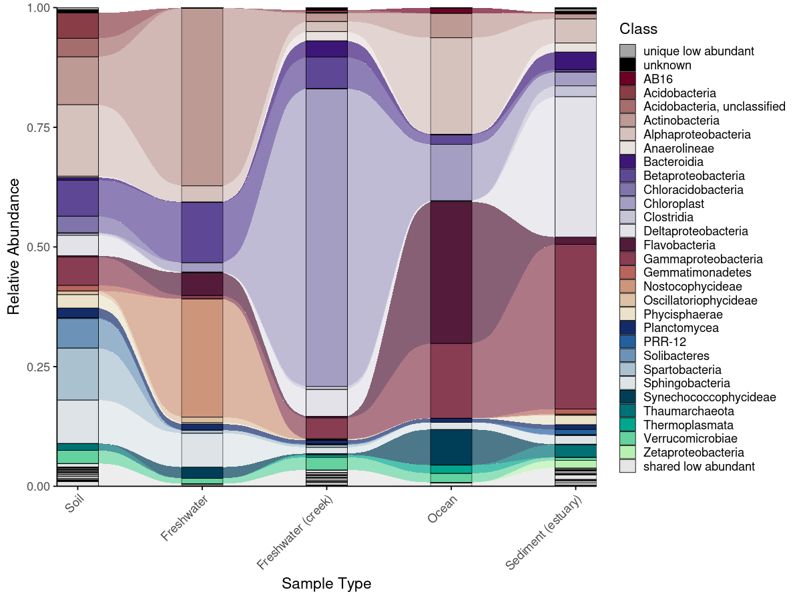
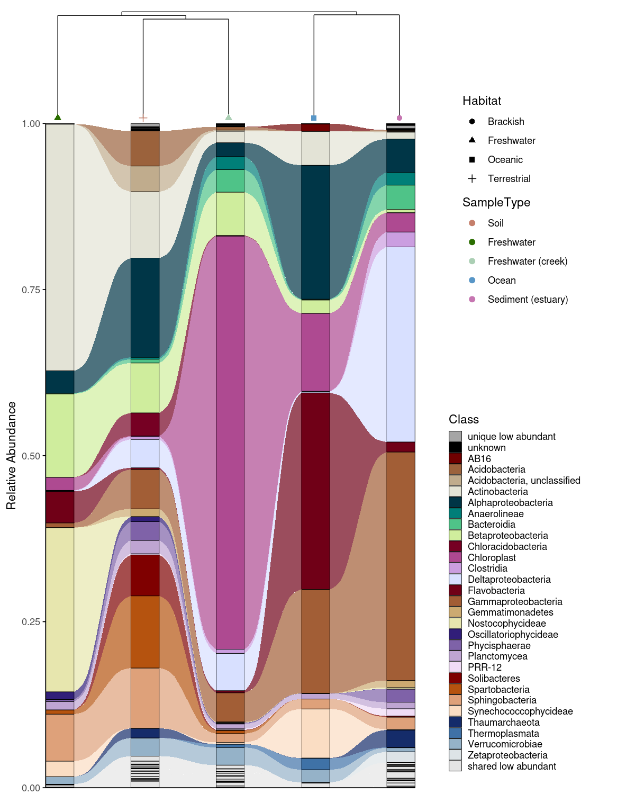

# phyloPal

> Taxonomic color palettes, alluvial plots, and dendrograms for
> microbiome data

## Overview

phyloPal makes it easy to create publication-ready microbiome
visualizations:

- 🎨 **Perceptually uniform HCL palettes** with optional hierarchical
  grouping by higher taxonomy — suitable for data with many taxonomic
  groups
- 📊 **Taxonomic barplots** with colored facet strips — no more fighting
  with `ggh4x` manually
- 🌊 **Alluvial plots** that correctly classify taxa as shared, unique,
  or mixed-abundance across groups
- 🌳 **Combined alluvial + dendrogram layouts** for showing beta
  diversity structure and taxonomic composition in one figure
- 🧹 **Taxonomy cleaning** that handles Incertae Sedis and propagates
  parent taxa to fill missing levels automatically

📖 See the [vignette](vignettes/introduction.Rmd) for a full tutorial.

``` r
browseVignettes("phyloPal")
```

## Installation

``` r
# install.packages("devtools")
devtools::install_github("mwslawinska/phyloPal")
```

## Example data

phyloPal includes a built-in example dataset derived from the
`GlobalPatterns` dataset (Caporaso et al., 2011) filtered to five
habitat types (Terrestrial, Oceanic, Freshwater, Brackish, Freshwater
creek). All examples in the documentation use this dataset.

``` r
library(phyloPal)

data(example_microbiome)  # long-format ASV table with pre-calculated RA
data(em_metadata)         # sample metadata
data(em_otu)              # OTU matrix for dendrogram construction

glimpse(example_microbiome)
```

## Workflows

### Taxonomic barplots with colored facet strips

Generating publication-ready barplots for microbiome data involves two
challenges: choosing colors that are perceptually uniform across many
taxa, and communicating sample grouping structure without cluttering the
figure. phyloPal addresses both.

[`generate_palette_hcl()`](reference/generate_palette_hcl.md) generates
HCL (Hue-Chroma-Luminance) palettes specifically suited for taxonomic
data — perceptually uniform across many colors, with fixed colors for
special categories like `"low abundant"` and `"unknown"` always placed
consistently. Optional hierarchical grouping assigns colors from the
same family to taxa sharing a higher-level group (e.g. all
Proteobacteria in blue tones), making the biological structure of the
community visible at a glance.

Colored facet strips add a second layer of grouping information without
an extra legend. If samples are faceted by `SampleType` but habitat
membership should also be visible, coloring the strips by habitat lets
the reader group panels visually — all freshwater panels share one
color, all oceanic panels another.
[`generate_grouped_palette()`](reference/generate_grouped_palette.md)
produces this palette in one call, and passing it to
`facet_strip_colors` in
[`plot_taxonomic_barplot()`](reference/plot_taxonomic_barplot.md)
applies it automatically — something that otherwise requires verbose
`ggh4x` boilerplate.

[`process_barplot_data()`](reference/process_barplot_data.md) handles
aggregation and low-abundance grouping before plotting. The
`keep_ratype` argument controls this: - `"collapse"` (simpler): all taxa
below the threshold are relabelled as “low abundant” and merged into a
single bin. This keeps the plot clean and is the right choice when you
only care about the dominant taxa. - `"separate"`: low-abundance taxa
are flagged but their original identity is preserved in a
`<tax_level>_original` column. The plot-level label becomes
`"low abundant"`, but the true taxon name is retained for downstream
use.

Both approaches are shown below.

``` r


em_barplot_processed <- process_barplot_data(
  em_cleaned,
  tax_level = "Class",
  group_vars = c("SampleType", "SampleID", "Habitat"),
  low_abundance_basis = "per_sample",
  low_abundance_threshold = 0.01,
  agg_fun = "sum",
  keep_ratype = "separate",
  clean_taxonomy = FALSE
)

# Palette for taxa
barplot_pal <- generate_palette_hcl(
  data = em_barplot_processed,
  tax_level = "Class",
  fixed_colors_enabled = TRUE,
  fixed_colors_position = "end",
  palette_list = c("Reds", "Purples", "BrwnYl", "Blues", "TealGrn"),
  cmax = 65,
  luminance = c(20,90),
    power = 1.2,
    shuffle = FALSE)


# Palette for facet strips — same color family per habitat
habitat_palette <- generate_grouped_palette(
  data = em_cleaned,
  group_col = "Habitat",
  item_col = "SampleType",
  palette_map = list(
    "Terrestrial" = "BrwnYl",
    "Oceanic" = "Blues",
    "Freshwater" = "Greens",
    "Brackish" = "PuRd"
  ),
  luminance = 65,
  power = 1.2
)

# Plot
plot_taxonomic_barplot(
  data = em_barplot_processed,
  tax_level = "Class",
  palette = barplot_pal,
  x_axis_var = "SampleID",
  facet_by = "SampleType",
  facet_strip_colors = habitat_palette,
  theme_obj = theme_phylopal()
) + 
  guides(
    fill = guide_legend(
      ncol = 1
    )
  ) 
```


Barplot with colored facet strips and separate low abundant taxa

``` r
plot_taxonomic_barplot(
  data = em_barplot_processed2,
  tax_level = "Class",
  palette = barplot_pal,
  x_axis_var = "SampleID",
  facet_by = "SampleType",
  facet_strip_colors = habitat_palette,
  theme_obj = theme_phylopal()
) + 
  guides(
    fill = guide_legend(
      ncol = 1
    )
  ) 
```

## 

### Alluvial plots

Alluvial plots show how taxonomic composition changes across groups —
which taxa are present everywhere, which are unique to one condition,
and which shift in abundance between groups. phyloPal automatically
classifies taxa as **shared abundant**, **shared low abundant**,
**unique abundant**, **unique low abundant**, or **shared mixed
abundance** (abundant in some groups, low in others). These categories
determine both the color assigned to each taxon and its stacking
position — shared taxa appear at the bottom, unique taxa toward the top,
and fixed categories like `"unknown"` and `"low abundant"` always occupy
consistent positions.

The full workflow runs in four steps
([`prepare_alluvial_data()`](reference/prepare_alluvial_data.md) →
[`classify_taxa_patterns()`](reference/classify_taxa_patterns.md) →
[`generate_alluvial_palette()`](reference/generate_alluvial_palette.md)
→ [`plot_alluvial()`](reference/plot_alluvial.md)), or in a single call
via [`create_alluvial_plot()`](reference/create_alluvial_plot.md).

``` r
# arrange the SampleType like you want
example_microbiome$SampleType <- factor(example_microbiome$SampleType, 
levels = unique(example_microbiome$SampleType))

# prepare alluvial data
em_allu <- prepare_alluvial_data(example_microbiome,
tax_level = "Class",
group_col = c("SampleType"),
clean_taxonomy = TRUE
)

# classify taxa patterns according to their abundance
em_allu_classified <- classify_taxa_patterns(
  data = em_allu,
  tax_level = "Class",
  group_col = c("SampleType")
)


# generate palette for the alluvial plot
allu_pal <- generate_alluvial_palette(
    data = em_allu_classified,
  palette_list = c("Reds", "Purples", "BrwnYl", "Blues", "TealGrn"),
  cmax = 65,
  luminance = c(20,90),
    power = 1.2,
    )

plot_alluvial(em_allu_classified, 
custom_palette = allu_pal,
tax_level = "Class", 
group_col = "SampleType",
theme_obj = theme_phylopal(),
line_width = 0.2,
x_axis_label = "Sample Type"
) +
theme(axis.text.x = element_text(angle = 45, hjust = 1)) +
  guides(
    fill = guide_legend(
      ncol = 1
    )
  )

# Or in one call
create_alluvial_plot(
  data = example_microbiome,
  tax_level = "Class",
  group_col = "SampleType",
  prepare_args = list(clean_taxonomy = TRUE),
  palette_list = c("Reds", "Purples", "BrwnYl", "Blues", "TealGrn"),
  palette_args = list(
    cmax = 65,
    luminance = c(20, 90),
    power = 1.2
  ),
  plot_args = list(
    theme_obj = theme_phylopal(),
    line_width = 0.2,
    x_axis_label = "Sample Type"
  )
) +
  ggplot2::theme(axis.text.x = ggplot2::element_text(angle = 45, hjust = 1, vjust = 1)) +
  ggplot2::guides(fill = ggplot2::guide_legend(ncol = 1))
```



Alluvial plot

------------------------------------------------------------------------

### Combined alluvial + dendrogram

An alluvial plot shows what is in each group — but not how similar the
groups are to each other overall. Combining it with a Bray-Curtis
dissimilarity dendrogram (computed via the `vegan` package; Oksanen et
al., 2022) lets the reader interpret compositional patterns in the
context of community-level relationships: groups that cluster closely in
the dendrogram are expected to share more taxa in the alluvial plot, and
deviations from this expectation become immediately visible.
[`combine_dendrogram_alluvial()`](reference/combine_dendrogram_alluvial.md)
stacks the two plots vertically and aligns their x-axes to the
dendrogram leaf order automatically — without this alignment, the two
plots would use independent orderings and the visual connection between
them would be lost.

A practical challenge in combining these plots is that dendrogram tips
rarely fall exactly at integer x positions, creating a subtle
misalignment with the alluvial columns beneath them. `dend_limits_left`
and `dend_limits_right` allow precise independent control of the left
and right edges of the dendrogram panel, nudging the tips into exact
alignment with the alluvial columns — something that is otherwise
surprisingly difficult to achieve with standard ggplot2 tools.

Increasing `dend_limits_left` adds space on the left side of the
dendrogram panel, pushing the leftmost tip further left — away from the
first alluvial column. Increasing `dend_limits_right` reduces space on
the right side, pushing the rightmost tip leftward — toward the center
and away from the last alluvial column. The two parameters therefore
behave asymmetrically: `dend_limits_left` pulls the left tip outward,
while `dend_limits_right` pulls the right tip inward. The correct values
depend on the number of groups and the specific clustering, so some
manual adjustment is expected and normal. For vertical dendrograms, use
`dend_limits_top` and `dend_limits_bottom` instead.

A convenience wrapper
[`create_alluvial_dendrogram_plot()`](reference/create_alluvial_dendrogram_plot.md)
runs the full pipeline from raw ASV/OTU matrix to combined figure in a
single call.

``` r
# Build dendrogram
em_otu_grouped <- create_grouped_matrix(
asv_matrix = em_otu,
metadata = em_metadata,
sample_col = "SampleID",
group_col= "SampleType",
group_order = "metadata"
)

em_dendrogram <- build_dendrogram(
  mat = em_otu_grouped,
  distance_method = "bray",
  cluster_method = "ward.D2"
)

em_dendrogram_plot <- plot_dendrogram(
  dend = em_dendrogram,
  metadata = em_metadata,
  label_from = "SampleType",      
  color_by = "SampleType",
  color_palette = habitat_palette,
  point_size = 2,
  orientation = "top",
  shape_by = "Habitat",
  theme_obj = theme_void() + theme(text = element_text(size = 7, color = "black"),
  legend.title = element_text(size = 7, color = "black"),)
)

# Plot alluvial
p_allu4dend <- create_alluvial_plot(
  data = example_microbiome,
  tax_level = "Class",
  group_col = "SampleType",
  prepare_args = list(clean_taxonomy = TRUE),
  palette_list = c("Reds", "Purples", "BrwnYl", "Blues", "TealGrn"),
  palette_args = list(
    cmax = 65,
    luminance = c(20, 90),
    power = 1.2
  ),
  plot_args = list(
    theme_obj = theme_phylopal(),
    line_width = 0.2,
    x_axis_label = "Sample Type"
  )
) +
  ggplot2::theme(axis.text.x = ggplot2::element_text(angle = 45, hjust = 1)) +
  ggplot2::guides(fill = ggplot2::guide_legend(ncol = 1))

combine_dendrogram_alluvial(
  alluvial_plot   = p_allu4dend +
  scale_y_continuous(expand = c(0,0), breaks = seq(0,1,0.1), limits = c(0,1))+
  ggplot2::guides(fill = guide_legend(ncol =1, title = "Class")),
  dendrogram_plot = em_dendrogram_plot +
  ggplot2::guides(color = guide_legend(ncol = 2, title = "Sample Type"), shape = guide_legend(ncol = 2)),
  dend_position   = "top",
  dend_height     = 0.15,
  strip_alluvial_x = FALSE,
  legend          = "separate",
  legend_source   = "both",       
  legend_position = "right",
  legend_rel_width = 0.75,            
  alluvial_margins    = ggplot2::margin(0, 0, 0, 0, unit = "cm"),
  dendrogram_margins    = ggplot2::margin(0, 0, 0.15, 0, unit = "cm"),
  outer_margins    = ggplot2::margin(0.2, 0.2, 0.2, 0.2, unit = "cm"),
  align = "panel",
  x_expand_zero = TRUE,
  align_x_centers = TRUE,
  leaf_order = em_dendrogram$order,
  overwrite_x_scales = TRUE,
  dend_limits_left = 0.4,  
  dend_limits_right = 0.18
) 
```


Combined alluvial and dendrogram

#### Convenience wrapper

[`create_alluvial_dendrogram_plot()`](reference/create_alluvial_dendrogram_plot.md)
runs the full pipeline — grouping the ASV/OTU matrix, building the
dendrogram, preparing and classifying alluvial data, generating the
palette, and combining the plots — in a single call. Arguments for each
internal step are passed as named lists (`build_dendrogram_args`,
`plot_dendrogram_args`, and `alluvial_args` with nested `prepare_args`,
`classify_args`, `palette_args`, `plot_args`). Layout parameters like
`dend_limits_left`, `dend_limits_right`, and `legend_rel_width` are
direct arguments rather than nested, since they are commonly adjusted.
The function returns a named list containing all intermediate objects
(`grouped_matrix`, `dendrogram`, `dendrogram_plot`, `alluvial`,
`combined_plot`), so any component can be accessed without rerunning the
pipeline.

``` r
res <- create_alluvial_dendrogram_plot(
  asv_matrix = em_otu,
  metadata = em_metadata,
  sample_col = "SampleID",
  group_col  = "SampleType",
  alluvial_data = example_microbiome,
  tax_level = "Class",
  dend_color_palette = habitat_palette,
  dend_shape_by = "Habitat",
  theme_alluvial = theme_phylopal(),
  theme_dendrogram = ggplot2::theme_void(),
  alluvial_args = list(
    return_all = TRUE,
    prepare_args = list(clean_taxonomy = TRUE),
    classify_args = list(low_abundance_threshold = 0.01),
    palette_args = list(
      palette_list = c("Reds", "Purples", "BrwnYl", "Blues", "TealGrn"),
      cmax = 65,
      luminance = c(20, 90),
      power = 1.2
    ),
    plot_args = list(
      line_width = 0.2,
      x_axis_label = "Sample Type"
    )
  ),
  post_plot_guides   = list(      # guides applied to alluvial
    fill = ggplot2::guide_legend(ncol = 1, title = "Class")
  ),    
  dend_limits_left = 0.4,  
  dend_limits_right = 0.18, 
  combine_args = list(
    legend_rel_width = 0.5,
    strip_alluvial_x = TRUE,  
    alluvial_margins = ggplot2::margin(0, 0, 0, 0, unit = "cm"),
    outer_margins    = ggplot2::margin(0.2, 0.5, 0.2, 0.2, unit = "cm") 
  )
)

res$combined_plot
```

## 

## Function reference

| Function | What it does |
|----|----|
| [`replace_incertae_sedis_NAs()`](reference/replace_incertae_sedis_NAs.md) | Clean taxonomy: normalize Incertae Sedis, propagate parent taxa |
| [`process_barplot_data()`](reference/process_barplot_data.md) | Aggregate ASV-level RA, mark low-abundance taxa |
| [`prepare_alluvial_data()`](reference/prepare_alluvial_data.md) | Aggregate and complete zeros for alluvial input |
| [`classify_taxa_patterns()`](reference/classify_taxa_patterns.md) | Classify taxa as shared/unique/mixed-abundance |
| [`generate_palette_hcl()`](reference/generate_palette_hcl.md) | HCL palette with optional hierarchical grouping |
| [`generate_grouped_palette()`](reference/generate_grouped_palette.md) | Assign color families to groups |
| [`generate_alluvial_palette()`](reference/generate_alluvial_palette.md) | Alluvial-aware palette |
| [`add_alpha()`](reference/add_alpha.md) | Add transparency to hex colors |
| [`plot_taxonomic_barplot()`](reference/plot_taxonomic_barplot.md) | Stacked barplot with optional colored facet strips |
| [`plot_alluvial()`](reference/plot_alluvial.md) | Alluvial/Sankey plot |
| [`build_dendrogram()`](reference/build_dendrogram.md) | Compute Bray-Curtis dendrogram |
| [`plot_dendrogram()`](reference/plot_dendrogram.md) | Plot dendrogram with metadata-colored labels |
| [`combine_dendrogram_alluvial()`](reference/combine_dendrogram_alluvial.md) | Combine alluvial + dendrogram |
| [`create_alluvial_plot()`](reference/create_alluvial_plot.md) | Full alluvial workflow wrapper |
| [`create_alluvial_dendrogram_plot()`](reference/create_alluvial_dendrogram_plot.md) | Full alluvial + dendrogram wrapper |
| [`theme_phylopal()`](reference/theme_phylopal.md) | Clean built-in ggplot2 theme |

------------------------------------------------------------------------

## References

Caporaso, J.G., et al. (2011). Global patterns of 16S rRNA diversity at
a depth of millions of sequences per sample. *PNAS*, 108, 4516–4522.

Oksanen, J., et al. (2022). vegan: Community Ecology Package. R package
version 2.6-4. <https://CRAN.R-project.org/package=vegan>

## Citation

If you use phyloPal in your research, please cite:

    Slawinska MW (2025). phyloPal: Taxonomic Color Palettes and
    Alluvial-Dendrogram Visualization for Microbiome Data.
    R package version 0.1.0.
    https://github.com/mwslawinska/phyloPal

## License

MIT © Magdalena W. Slawinska
